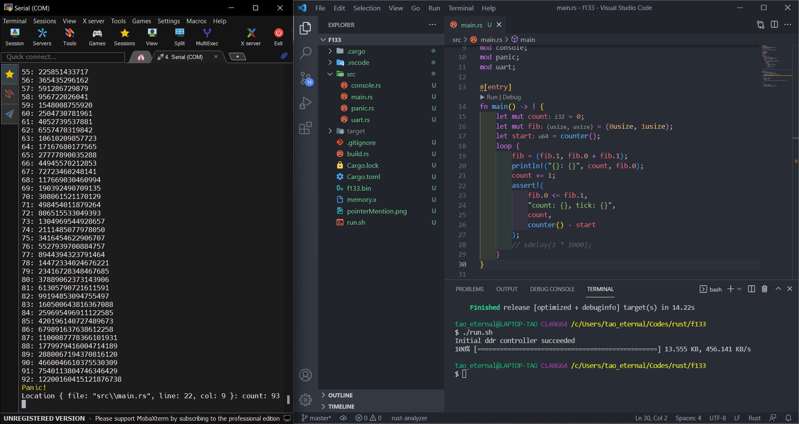

***
# RUST on your MQ-F133A board

Run on dram, depends on xfel


## Final Result




## Needed

* `rust-nightly` toolchain
* `cargo binutils`
* `riscv64gc-unknown-none-elf` target
* [`xfel`](https://github.com/xboot/xfel) tool

## Pin Connections

```
PE2(tx0) ----------> rx

PE3(rx0) <---------- tx

  GND    <---------> GND
```

## Getting Started

1. Make sure you have all done above

2. Connect your board through OTG port with your usb cable

3. just run commands below ( Windows user can also run these in mingw environment )

```shell
cargo objcopy -- -O binary --strip-all f133.bin
./run.sh
```


## Board Spectification

  * D1s (f133) with 64MB DDR, RISC-V  core up to 1GHz
  * Type-C USB-OTG and HOST
  * 22Pin expand x2(all pins out)
  * TF card
  * RTL8189F WiFi or other WiFi/BT module (optional)
  * FPC connector 15Pins DSI, 40Pins RGB, 24Pins DVP/RMII, 6Pins CTP
  * MIC and Audio OUT
  * Fel,reset button
  * 4x4cm size

## Links

* [Tiny FEL tools for allwinner SOC.](https://github.com/xboot/xfel)

## License

MIT License

Copyright (c) 2022 Tao_eternal

Permission is hereby granted, free of charge, to any person obtaining a copy
of this software and associated documentation files (the "Software"), to deal
in the Software without restriction, including without limitation the rights
to use, copy, modify, merge, publish, distribute, sublicense, and/or sell
copies of the Software, and to permit persons to whom the Software is
furnished to do so, subject to the following conditions:

The above copyright notice and this permission notice shall be included in all
copies or substantial portions of the Software.

THE SOFTWARE IS PROVIDED "AS IS", WITHOUT WARRANTY OF ANY KIND, EXPRESS OR
IMPLIED, INCLUDING BUT NOT LIMITED TO THE WARRANTIES OF MERCHANTABILITY,
FITNESS FOR A PARTICULAR PURPOSE AND NONINFRINGEMENT. IN NO EVENT SHALL THE
AUTHORS OR COPYRIGHT HOLDERS BE LIABLE FOR ANY CLAIM, DAMAGES OR OTHER
LIABILITY, WHETHER IN AN ACTION OF CONTRACT, TORT OR OTHERWISE, ARISING FROM,
OUT OF OR IN CONNECTION WITH THE SOFTWARE OR THE USE OR OTHER DEALINGS IN THE
SOFTWARE.